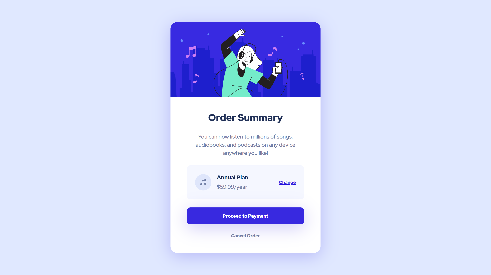

# Frontend Mentor - Order summary card solution

This is a solution to the [Order summary card challenge on Frontend Mentor](https://www.frontendmentor.io/challenges/order-summary-component-QlPmajDUj). Frontend Mentor challenges help you improve your coding skills by building realistic projects.

## Table of contents

- [Overview](#overview)
  - [The challenge](#the-challenge)
  - [Screenshot](#screenshot)
  - [Links](#links)
- [My process](#my-process)
  - [Built with](#built-with)
  - [What I learned](#what-i-learned)
  - [Continued development](#continued-development)
- [Author](#author)

## Overview

### The challenge

Users should be able to:

- See hover states for interactive elements

### Screenshot



### Links

- Solution URL: (https://www.frontendmentor.io/solutions/order-summary-component-zTP8ggv8yy)
- Live Site URL: (https://dreamy-boba-34d9d6.netlify.app/)

## My process

1. Plan and outline the website
2. Set up the project
3. Add HTML5 semantic tags
4. Add CSS custom properties
5. Use Flexbox for layout
6. Style the website
7. Add hover and active transition for buttons
8. Test and refine
9. Deploy the website

### Built with

- Semantic HTML5 markup
- CSS custom properties
- Flexbox
- CSS Transitions
- CSS :hover Selector
- CSS :active Selector

### What I learned

1. Using :active Selector

```css
.card .card-text #plan #plan-right button:active {
  color: hsl(245, 75%, 42%);
  transition: none;
}

.card .card-text #payment-btn:active {
  background: hsl(245, 75%, 42%);
  transition: none;
}

.card .card-text #cancel-btn:active {
  color: hsl(223, 47%, 13%);
  transition: none;
}
```

### Continued development

As of the writing of this section, I have no areas that I want to continue focusing on more in future projects.

## Author

- Frontend Mentor - [@erlanggaadptr](https://www.frontendmentor.io/profile/erlanggaadptr)
